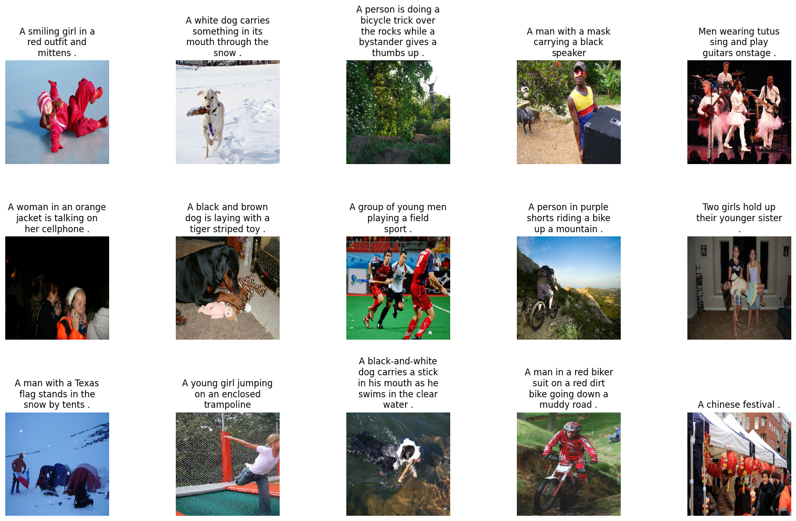
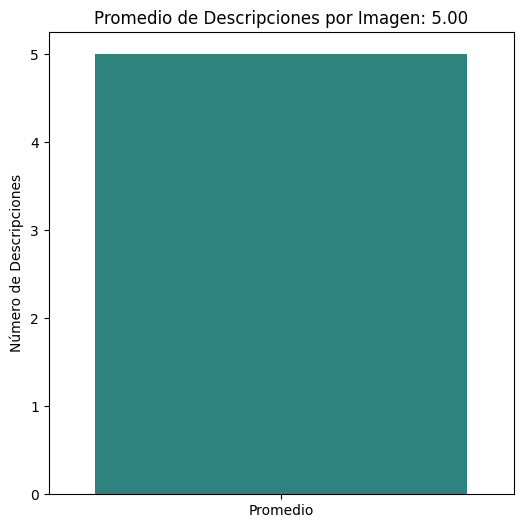

# Reporte de Datos

Este documento contiene los resultados del análisis exploratorio de datos.

## Resumen general de los datos

En esta sección se presenta un resumen general de los datos del conjunto Flickr8k. El conjunto de datos incluye imágenes y sus respectivas descripciones. En el análisis se incluyen las características extraídas de las imágenes y las descripciones textuales que acompañan a cada una.

- Número total de observaciones: El conjunto de datos contiene un total de 8,000 imágenes con sus descripciones correspondientes.
- Variables: Las principales variables en el conjunto de datos son:
  - image_id (identificador único de cada imagen).
  - caption (descripción de cada imagen).
- Tipos de variables:
  - image_id: Categórica (String).
  - caption: Categórica (String).
- Valores faltantes: El análisis muestra que no existen valores faltantes en las variables clave (image_id, caption, features).

### Visualización de los Datos

A continuación, se presenta ejemplificados los datos a utilizar mencionados anteriormente:

### Cantidad de Descrípciones en Promedio por Imagen

La cantidad de descrípciones en promedio es de 5 descripciones por imagen tal y como se muestra en el siguiente grafico.

## Resumen de calidad de los datos

En esta sección se presenta un análisis sobre la calidad de los datos, con un enfoque en valores faltantes, valores extremos, errores y duplicados.

- Valores faltantes: Se verificó que no hay valores faltantes en el conjunto de datos. Todas las imágenes tienen descripciones asociadas y características extraídas.
- Valores extremos: Las características extraídas de las imágenes están representadas como listas de valores flotantes. Se realizó un análisis para identificar posibles valores extremos, y no se encontraron valores atípicos significativos en las características extraídas de las imágenes.
- Errores: Se han realizado validaciones en las descripciones (captions.txt) para verificar que no haya errores de formato. Todo el texto sigue un formato consistente.
- Duplicados: No se encontraron registros duplicados en el conjunto de datos. Todos los image_id son únicos, lo que garantiza que no haya duplicación de imágenes o descripciones.

## Variable objetivo

En este caso, no hay una "variable objetivo" explícita, ya que este es un conjunto de datos utilizado principalmente para tareas como la generación de descripciones automáticas de imágenes o la clasificación de imágenes. Sin embargo, si se desea predecir las características o las descripciones de las imágenes, se podría considerar como objetivo predecir caption (descripción).

Distribución de la variable objetivo (descripción):

- Las descripciones son texto libre que varía según la imagen, por lo que no hay una distribución numérica directa de las descripciones.
- Gráficos: Para visualizar la distribución de las longitudes de las descripciones, se pueden generar histogramas de la cantidad de palabras por cada caption.

## Variables individuales

En esta sección se presenta un análisis detallado de cada variable:

- image_id:
  - Es un identificador único para cada imagen.
  - Estadísticas descriptivas: No es una variable numérica, por lo que no tiene estadísticas como media o desviación estándar.
  - Gráfico: Como es un identificador único, no tiene una distribución significativa que se pueda graficar.
- caption:
  - Las descripciones son texto, por lo que se realiza un análisis de la longitud de las descripciones y de las palabras más frecuentes.
  - Estadísticas descriptivas: Se calculan las longitudes de las descripciones (en términos de número de palabras).
  - Gráfico de distribución: Un histograma de la longitud de las descripciones (número de palabras por caption).
- Posibles transformaciones:
- Tokenización de las descripciones para crear una representación numérica (por ejemplo, usando el enfoque Bag of Words o TF-IDF).
- Eliminación de palabras comunes o stopwords si se quiere mejorar la calidad del modelo de predicción de descripciones.

## Ranking de variables

Para este análisis, ya que estamos trabajando con imágenes y descripciones, las variables más importantes podrían ser:

- caption: Aunque es texto, es crucial en tareas como la generación de descripciones automáticas de imágenes o la clasificación de imágenes basada en texto.
- image_id: Aunque es importante para la referencia y el vínculo entre imágenes y descripciones, no es una variable predictiva directa en términos de análisis de contenido.

Se puede utilizar técnicas como PCA (Análisis de Componentes Principales) o modelos de aprendizaje automático como redes neuronales o regresión para identificar qué variables contribuyen más a la predicción o al análisis de las imágenes.

## Relación entre variables explicativas y variable objetivo

La relación entre las imagenes (características de la imagen) y las caption (descripción) es la clave para tareas de generación de texto o clasificación de imágenes. Los modelos de aprendizaje profundo, como las redes neuronales convolucionales (CNN) para las características y redes neuronales recurrentes (RNN) o Transformers para las descripciones, pueden aprender esta relación.

- Gráficos: Se pueden utilizar gráficos de dispersión o matrices de correlación para explorar la relación entre las características extraídas de las imágenes y las palabras en las descripciones.
- Técnicas: Se puede usar regresión o modelos de aprendizaje profundo para modelar la relación entre las características de las imágenes (features) y las descripciones de texto (caption).
